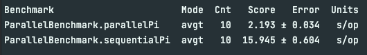

# 스트림 병렬화는 주의해서 적용하라 
> 동시성 프로그래밍을 할 때는 안전성(safety)과 응답 가능(liveness) 상태를 유지하기 위해 애써야 한다.

## 모든게 병렬화가 잘 되는 것은 아니다
- 환경이 아무리 좋더라도, 데이터 소스가 `Stream.iterate`거나, 중간 연산으로 `limit`을 쓰면, 파이프라인 병렬화로는 성능 개선을 기대할 수 없다.
- 파이프라인 병렬화는 `limit`을 다룰 때, CPU 코어가 남는 경우 원소를 몇개 더 처리한 후 제한된 개수 이후의 결과를 버려도 아무런 해가 없다고 가정한다.
- 파이프라인 병렬화가 작업을 CPU코어 수 만큼 병렬로 수행한다고 가정할 때(메르센 소수 계산법)
  - 쿼드코어 상에서 19번째 계산까지 마치고 마지막 20번째 계산이 수행되는 시점이라고 가정
  - CPU 코어 3개가 한가할 것이다. 따라서 21,22,23번째 메르센 소수를 찾는 작업이 병렬로 시작 되는데, 20번째 계산이 끝나더라도 해당 계산들은 끝나지 않는다.
  - 각각 20번째 계산보다 2배, 4배, 8배의 시간이 더 필요하기 때문이다.

> 즉, 스트림 파이프라인을 마구잡이로 병렬화 하지 말자. 성능이 끔찍하게 나빠질 수 있다. 

## 병렬화 효과가 좋은 스트림 소스
- ArrayList
- HashMap
- HashSet
- ConcurrentHashMap
- Array
- int 범위
- long 범위

- 위 자료구조들은 데이터를 원하는 크기로 정확하고 손쉽게 나눌 수 있다
  - 일을 다수의 스레드에 분배하기 좋다
  - 나누는 작업은 Spliterator가 담당한다 
  - Spliterator 객체는 Stream이나 Iterable의 spliterator 메서드로 얻어올 수 있다.

- 위 자료구조들은 원소들을 순차적으로 실행할 때의 참조 지역성(locality of reference)이 뛰어나다.
  - 이웃한 원소의 참조들이 메모리에 연속해서 저장되어 있다는 뜻이다.
  - 참조들이 가리키는 실제 객체가 메모리에서 서로 떨어져있을 수 있다. -> 참조 지역성이 나빠진다.
    - 참조 지역성이 낮을 경우, 스레드는 데이터가 주 메모리에서 캐시메모리로 전송되어 오기를 기다리며, 아무것도 안하고 시간을 보내게 된다.
  - 따라서, 참조 지역성은 다량의 데이터를 처리하는 벌크 연산을 병렬화할 때 아주 중요한 요소로 작용한다.
  - 참조 지역성이 가장 뛰어난 자료구조는 **기본 타입 배열**이다.
    - 기본 타입 배열에는 "참조가 아닌" 데이터 자체가 메모리에 연속 저장되기 때문이다.

### 스트림 파이프라인의 종단 연산 동작 방식도 병렬 수행 효율에 영향을 준다.
- 종단 연산에서 수행하는 작업량이 파이프라인 전체에서 상당 비중을 차지 + 순차적인 연산일 경우
  - 파이프라인 병렬 수행의 효과가 제한된다.
- 종단 연산 중, 병렬화에 가장 적합한 연산은 `reduction`이다.
  - 파이프라인에서 만들어진 모든 원소를 하나로 합치는 작업
  - reduce, min, max, sum, count, anyMatch, allMatch, noneMatch
- 가변 축소를 수행하는 `collect`메서드는 병렬화에 적합하지 않다.
  - 컬렉션을 합치는 부담이 크다 


### 직접 구현한 Stream, Iterable, Collection이 병렬화의 이점을 제대로 누리게 하고싶은 경우
- spliterator 메서드를 반드시 재정의할 것
- 결과 스트림의 병렬화 성능을 강도 높게 테스트 할 것
- 고효율 spliterator를 작성하는 일은 난이도가 높다.


### 스트림을 잘못 병렬화 할 경우 (응답 불가 포함)
- 성능이 나빠진다.
- 결과 자체가 잘못될 수 있다.
- 예상치 못한 동작이 발생할 수 있다.


특히, 결과가 잘못되거나 오동작하는 것은 안전 실패(safety failure)라고 한다.
- 안전 실패는 병렬화한 파이프라인이 사용하는 mappers, filters, 혹은 함수 객체가 명세 대로 동작하지 않을 때 벌어질 수 있다.
- Stream 명세는 엄중한 규약을 정해놨으므로 지키자.
- 예를 들어
  - Stream의 reduce 연산에 건네지는 accumulator와 combiner 함수는 반드시 아래의 규칙을 만족해야 한다.
    - 결합 법칙(associative) : op이 연산자/함수 일 때, (a op b) op c == a op (b op c)를 만족하는 것 
    - 간섭 받지 않아야 함(non-interfering) : 파이프라인이 수행되는 동안 데이터 소스가 변경되지 않아야 함 
    - 상태를 갖지 않아야 함(stateless)


### 성능 향상이 가능할지 추정해보는 방법 
- 스트림 안의 원소 수와, 원소 당 수행되는 코드 줄 수를 곱해보자. 이 값이 최소 수십만은 되어야 성능 향상을 맛볼 수 있다.


### 스트림 병렬화는 오직 성능 최적화 수단일 뿐이다.
- 변경 전후로 반드시 성능 테스트를 하여 병렬화를 사용할 가치가 있는지 확인하라 
- 이상적으로는 운영 시스템과 흡사한 환경에서 테스트 하는 것이 좋다. 
- 보통, 병렬 스트림 파이프라인도 공통의 포크-조인 풀에서 수행되므로(같은 스레드 풀을 사용하므로), 잘못된 파이프라인 하나가 시스템의 다른 부분 성능에까지 악영향을 줄 수 있음을 주의하자.


### 스트림 파이프라인을 병렬화 할 일이 적은가?
- 그렇다. 병렬화가 효과를 보는 경우가 많지 않다. 
- 하지만, 조건이 잘 갖춰지면 **parallel 메서드 호출 하나로 거의 프로세서 코어 수에 비례하는 성능 향상을 만끽할 수 있다**


### 그래도, 스트림 파이프라인 병렬화가 효과를 볼 수 있긴 하다
다음은, n보다 작거나 같은 소수의 개수를 계산하는 함수다.
- 테스트는 jmh로 진행하였다.
- N = 10,000,000으로 설정하였다.


```java
public long sequentialPi() {
        return LongStream.rangeClosed(2, N)
                .mapToObj(BigInteger::valueOf)
                .filter(i -> i.isProbablePrime(50))
                .count();
    }

public long parallelPi() {
        return LongStream.rangeClosed(2, N)
                .parallel()
                .mapToObj(BigInteger::valueOf)
                .filter(i -> i.isProbablePrime(50))
                .count();
    }
```


