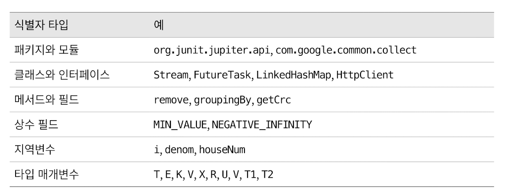

# 일반적으로 통용되는 명명 규칙을 따르라 
- 철자와 문법 규칙을 지켜라 
- 조직 바깥에서도 사용될 패키지라면 조직의 인터넷 도메인 이름을 역순으로 사용
  - `com.google`
- 표준 라이브러리와 선택적 패키지들은 `java`, `javax`로 시작함 
- 패키지 이름의 나머지는 해당 패키지를 설명하는 하나 이상의 요소로 구성 
  - 8자 이하의 짧은 단어 
  - `utilities` -> `util`처럼 의미가 통하는 약어를 추천 
- 타입 매개변수
  - T : 임의의 타입
  - E : 컬렉션 원소
  - K, V : 키 밸류
  - X : 예외
  - R : 반환 타입

## 문법 규칙 
- 객체를 생성할 수 있는 클래스 
  - 단수 명사, 명사구 
- 객체를 생성할 수 없는 클래스(유틸성 클래스)
  - 복수형 명사 
- 인터페이스
  - 클래스와 명명 규칙을 동일하게 가져가거나 
  - ~able, ~ible로 끝나는 형용사로 지음 
- 메서드
  - 어떤 동작을 수행함 : 동사구 
  - 불리언을 반환함 : is/has
  - 불리언이 아니거나 해당 인스턴스 속성을 반환함 : 명사, 명사구, getXxx
  - 객체의 타입을 바꿔서 다른 타입의 또 다른 객체를 반환함 : to + Type
  - 객체의 내용을 다른 뷰로 보여줌 : as + Type
  - 객체를 기본 타입 값으로 반환함 : type + Value
  - 정적 팩터리의 이름 : from, of, valueOf, instance, newInstance, getInstance, getType, newType...