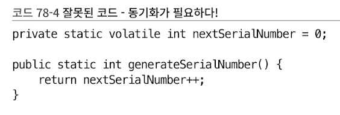

# 과도한 동기화는 피하라 
- 과도한 동기화는 성능을 떨어뜨리고, 교착상태에 빠뜨리고, 심지어 예측할 수 없는 동작을 낳기도 함 


- 응답 불가와 안전 실패를 피하기 위해서는, 동기화 메서드나 동기화 블록 안에서는 제어를 절대로 클라이언트에게 양도해선 안됨
  - 동기화된 영역 안에서 재정의할 수 있는 메서드는 호출하면 안됨 
  - 동기화된 영역 안에서 클라이언트가 넘겨준 함수 객체를 호출하면 안됨


- 외부에서 건너온 메서드들은 모두 바깥 세상에서 온 외계인이다.
  - 그 메서드가 무슨 일을 할지 알 수 없음 
  - 통제도 불가능함 
  - alien method가 하는 일에 따라, 동기화된 영역은 예외를 발생시키거나 교착 상태에 빠지거나, 데이터를 훼손할 수 있음 


### 아래의 예제는 동시 수정이 발생하지 않도록 보장하지만, 메서드 내에서 수행하는 순회는 동기화 블록 안에있다.
#### - 동시 수정이 일어나지 않도록 보장하지만, 정작 자신이 콜백을 거쳐 되돌아와 수정하는 것 까지는 막지 못함 
#### - 또한, 백그라운드 스레드가 접근할 시 메인 스레드와 환장의 콜라보로 데드락에 빠짐 
```java
package chapter_11.item79;

import java.util.ArrayList;
import java.util.Collection;
import java.util.List;
import java.util.Set;

public class ObservableSet<E> {
    private final Set<E> set;
    private final List<SetObserver<E>> observers = new ArrayList<>();

    public ObservableSet(final Set<E> set) {
        this.set = set;
    }

    public void addObserver(SetObserver<E> observer) {
        synchronized (observers) {
            observers.add(observer);
        }
    }

    public void removeObserver(SetObserver<E> observer) {
        // notifyElement가 호출되어 수행되는 도중에 호출됨 -> 메인 스레드가 락을 쥐고 있는 상태라, 다른 스레드가 접근하면 교착 상태에 빠짐
        synchronized (observers) {   // 메인 스레드는 여기가 수행되기만을 기다리는 중 -> 데드락!
            observers.remove(observer);
        }
    }

    private void notifyElement(E elem) {
        synchronized (observers) {  // 여기서 메인 스레드가 락을 쥐고있다?
            for (SetObserver<E> observer : observers) {
                observer.added(this, elem);  // 동시 수정이 발생하지 않도록 보장하나, 자기 자신을 되돌아와 수정하는 것은 못막음
            }
        }
    }

    public boolean add(E elem) {
        final boolean added = set.add(elem);
        if (added) {
            notifyElement(elem);
        }

        return added;
    }

    public boolean addAll(Collection<? extends E> c) {
        boolean result = false;
        for (E elem : c) {
//            result |= add(elem);
            result = result | add(elem);
        }
        return result;
    }
}

```

#### 교착 상태(데드락)에 빠지게 하는 코드
```java
public class Main {
    public static void main(String[] args) {
        final ObservableSet<Integer> set = new ObservableSet<>(new HashSet<>());

        // 이상한 짓 -> 교착 상태에 빠진다!
        set.addObserver(new SetObserver<>() {
            @Override
            public void added(final ObservableSet<Integer> s, final Integer e) {
                System.out.println(e);
                if (e == 23) {
                    final ExecutorService threadPool = Executors.newSingleThreadExecutor();

                    try {
                        threadPool.submit(() -> s.removeObserver(this)).get();
                    } catch (ExecutionException | InterruptedException ex) {
                        throw new AssertionError(ex);
                    } finally {
                        threadPool.shutdown();
                    }
                }
            }
        });

        for (int i = 0; i < 100; i++) {
            set.add(i);
        }
    }
}
```

- 위와 같이, 동기화된 영역 안에서 외계인 메서드(외부 메서드)를 호출하여 교착 상태에 빠지는 사례는 자주 있음
- 그나마 위 예시는 동기화 영역이 보호하는 자원은 외계인 메서드가 호출될 때 일관된 상태여서 다행인 예시임 


### 불변식이 임시로 깨진 케이스 
- 자바 언어의 락은 재진입(reentrant)을 허용 -> 교착 상태에 빠지지는 않음 
  - 위 첫번째 예시에서 `concurrent`예외를 발생시킨 경우에, 외계인 메서드를 호출하는 스레드는 이미 락을 쥐고 있음 
  - 때문에 다음번 락 획득도 성공함 
  - 락이 보호하는 데이터에 대해 개념적으로 관련이 없는 다른 작업이 진행 중인데도 락을 획득 해버리는게 문제 ??
  - 이는 락이 제 구실을 하지 못했기 때문임


- 재진입 가능 락은 객체 지향 멀티스레드 프로그램을 쉽게 구현할 수 있게 해주나, 응답 불가(교착상태)가 될 상황을 안전 실패(데이터 훼손)로 변모시킬 가능성이 있음
  - [JLS 14.19 - synchronized statement](https://docs.oracle.com/javase/specs/jls/se8/html/jls-14.html#jls-14.19)

  
이로 인한 문제는 외계인 메서드 호출을 아래와 같이 동기화 블록 바깥으로 옮김으로써 해결 가능 

```java
private void notifyElement(E elem) {
    List<SetObserver<E>> snapshot = null;
    synchronized (observers) {
        snapshot = new ArrayList<>(observers);
    }

    for (SetObserver<E> observer : snapshot) {
        observer.added(this, elem);
    }
}
```
- 위와 같이 변경할 경우, for문을 락 없이 안전하게 순회 가능 -> 예외 발생 및 교착 상태가 사라짐  

### 더 나은 방법 -> 외계인 메서드를 동기화 블록 바깥으로 옮기기 
- `CopyOnWriteArrayList` 사용 
  - 내부를 변경하는 작업은 항상 복사본을 만들어 수행하는 클래스 
  - 내부의 배열은 절대 수정되지 않아, 순회 시 락이 필요 없어 매우 빠름 
  - 수정할 일은 드물고 순회만 빈번히 일어나는 관찰자 리스트 용도로는 최적임 


```java
public class ObservableSetVer2<E> {
    private final Set<E> set;
    private final List<SetObserverVer2<E>> observers = new CopyOnWriteArrayList<>();

    public ObservableSetVer2(final Set<E> set) {
        this.set = set;
    }

    public void addObserver(SetObserverVer2<E> observer) {
        observers.add(observer);
    }

    public void removeObserver(SetObserverVer2<E> observer) {
        observers.remove(observer);
    }

    private void notifyElement(E elem) {
        for (SetObserverVer2<E> observer : observers) {
            observer.added(this, elem);
        }
    }

    public boolean add(E elem) {
        final boolean added = set.add(elem);
        if (added) {
            notifyElement(elem);
        }

        return added;
    }

    public boolean addAll(Collection<? extends E> c) {
        boolean result = false;
        for (E elem : c) {
//            result |= add(elem);
            result = result | add(elem);
        }
        return result;
    }
}
```

- 동기화 영역 바깥에서 호출되는 외계인 메서드를 **열린 호출(open call)** 이라 함 
  - 외계인 메서드는 얼마나 오래 실행될지 알 수 없음
  - 동기화 영역 안에서 호출될 시, 다른 스레드는 보호된 자원을 사용하지 못하고 대기하게 되어버림
  - 따라서, 열린 호출은 실패 방지 효과 외에도 동시성 효율을 크게 개선해줌 


## 기본 규칙
- **동기화 영역에서는 가능한 한 일을 적게 하라**
  - 락을 얻고, 공유 데이터를 검사하고, 필요하면 수정하고, 락을 놓는다.
  - 오래 걸리는 작업이라면 아이템 78의 지침을 어기지 않으면서 동기화 영역 바깥으로 옮기는 방법을 찾아보자.


## 성능 
- 과도한 동기화를 피하는 일은 매우 중요하다.
- 멀티코어가 일반화된 오늘날, 과도한 동기화가 초래하는 진짜 비용은 락을 얻는 데 드는 CPU 시간이 아님 
  - **경쟁 하느라 낭비하는 시간**, 즉 병렬로 실행할 기회를 잃고, **모든 코어가 메모리를 일관되게 보기 위한 지연 시간**이 진짜 비용임
  - **가상머신의 코드 최적화를 제한한다는 점** 또한 과도한 동기화의 또 다른 숨은 비용임 

## 가변 클래스를 작성하려거든 아래의 지침 중 하나를 따르자 
### 1. 동기화를 전혀 하지 말고, 그 클래스를 동시에 사용해야 하는 클래스가 외부에서 알아서 동기화 하게 하자
### 2. 동기화를 내부에서 수행해 스레드 안전한 클래스를 만들자 
- 단, 클라이언트가 외부에서 객체 전체에 락을 거는 것 보다 동시성을 월등히 개선할 수 있을 때만 2번 방법을 택한다. 


## 자바의 패키지 
### java.util
- Vector, HashTable을 제외하고는 1번 방식을 택함 

### java.util.concurrent
- 2번 방식을 택함 


## 지침을 따르지 않은 자바의 클래스 
### StringBuffer
- 거의 단일 스레드에서 쓰였음에도 내부적으로 동기화 수행 
- 뒤늦게 StringBuilder가 등장한 이유이기도 함 (StringBuilder == 동기화 하지 않은 StringBuffer)


### java.util.Random
- 스레드 안전한 의사 난수 생성기
- 하지만 이는 동기화 하지 않는 버전인 `java.util.concurrent.ThreadLocalRandom`으로 대체되었음 

## 클래스를 내부에서 동기화 하기로 한 경우 
### 다양한 기법을 동원해 동시성을 높여줄 수 있음 
- 락 분할(lock splitting)
- 락 스트라이핑(lock striping)
- 비차단 동시성 제어(nonblocking concurrency control)
- [참고 자료](https://github.com/Java-Bom/ReadingRecord/issues/141)


## 여러 스레드가 호출할 가능성이 있는 메서드가 정적 필드를 수정할 경우 
- 해당 필드를 사용하기 전에 반드시 동기화 할 것 
- 비결정적 행동도 용인하는 클래스라면 상관 없다
  - 비결정적 행동 == 원치않는 결과 == 버그 == 사이드이펙트 

그런데, 클라이언트가 여러 스레드로 복제돼 구동되는 상황이라면
- 다른 클라이언트에서 이 메서드를 호출하는 것을 막을 수 없음 -> 외부에서 동기화할 방법 없음 
- 결과적으로, 해당 정적 필드가 심지어 private라도 서로 관련 없는 스레드들이 동시에 읽고 수정할 수 있게 됨(???) 
- 사실상 전역 변수와 같아짐(????)


- 위 코드의 상태가 위와 같은 상황이라고 할 수 있음 


## 정리
- 교착 상태와 데이터 훼손을 피하기 위해서는 동기화 영역 안에서 외계인 메서드를 절대 호출하지 말자
- 동기화 영역 안에서의 작업은 최소한으로 줄이자 
- 가변 클래스를 설계할 때는 스스로 동기화해야 할지를 고민하자 
- 멀티코어 세상인 현재는 과도한 동기화를 피하는게 중요하다 
- 합당한 이유가 있을 때만 내부에서 동기화하고, 동기화 여부를 문서에 명확히 밝히자 